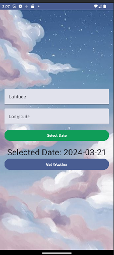
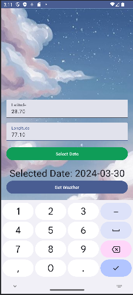
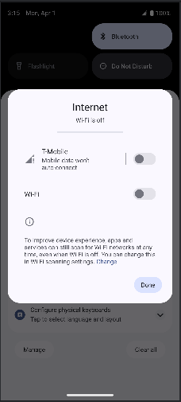
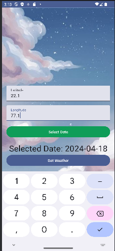
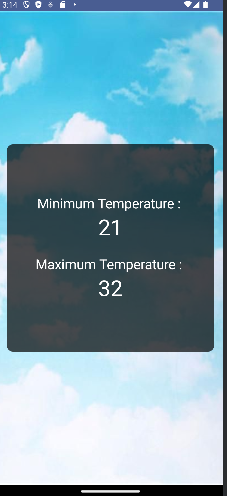

# WeatherApp
## Screenshots

### Loading Screen

Description: This screen allows users to input latitude, longitude, and date to fetch weather data.

### Inputs Given

Description: Users input their latitude, longitude, and date for weather forecast retrieval.

### Result Screen - Internet On

Description: Displays the weather forecast for the given date when internet connection is available.

### Result Screen - Internet Off

Description: Displays the weather forecast from the local database when internet connection is not available.

### Future Date Selection

Description: Users can select a future date for weather forecast retrieval.

### Future Output - Internet On

Description: Displays the weather forecast for a future date when internet connection is available.

### Internet Off - Result Screen

Description: Displays the weather forecast from the local database for a future date when internet connection is not available.
